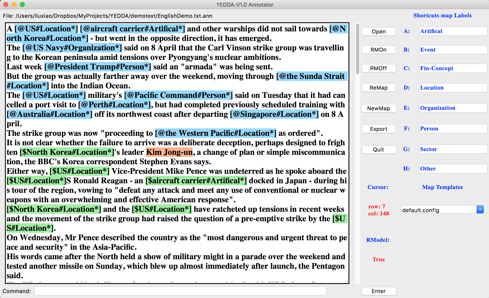
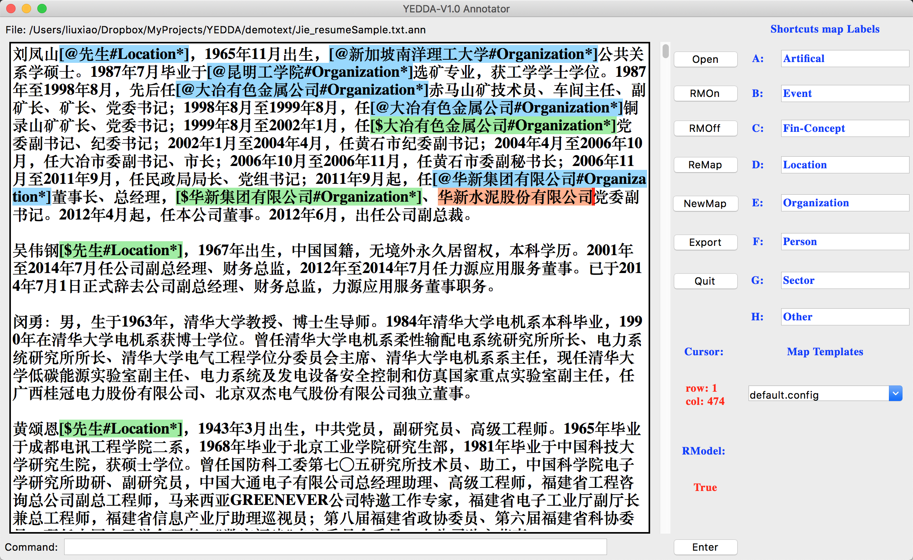
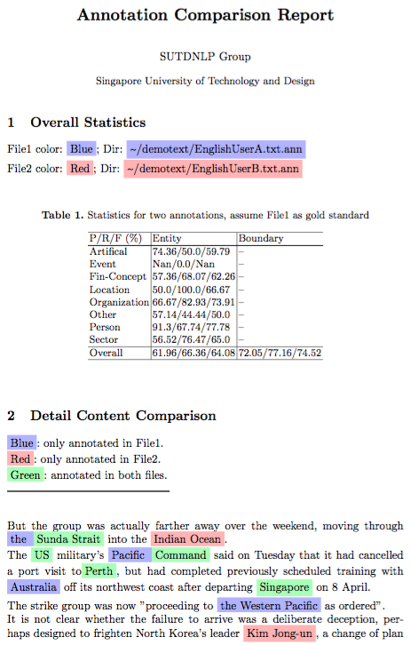

 

--------------------------------------------------------------------------------

YEDDA: A Lightweight Collaborative Text Span Annotation Tool
====

About:
====
YEDDA (the previous SUTDAnnotator) is developed for annotating chunk/entity/event on text (almost all languages including English, Chinese), symbol and even emoji. It supports shortcut annotation which is extremely efficient to annotate text by hand. The user only need to select text span and press shortcut key, the span will be annotated automatically. It also support command annotation model which annotates multiple entities in batch and support export annotated text into sequence text. Besides, intelligent recommendation and adminstrator analysis is also included in updated version. It is compatiable with all mainstream operating systems includings Windows, Linux and MacOS. 

For more details, please refer to [our paper (ACL2018:demo, best demo nomination)](https://arxiv.org/pdf/1711.03759.pdf).

This GUI annotation tool is developed with tkinter package in Python. 

System required: Python 2.7

Author: [Jie Yang](https://jiesutd.github.io), Assistant Professor at Zhejiang University, China.

Interface:
====
It provides both annotator interface for efficient annotatation and admin interface for result analysis.
* Annotator Interface:
 
 
* Administrator Interface:
 

Use as an annotator ?
====
* Start the interface: run `python YEDDA.py`
* Select a shortcut map from `./configs/` in the right bottom drop-down list
* Configure your shortcut map in the right side of annotation interface, you can leave other labels empty if the shortcut number is enough. For example: `a: Action; b: Loc; c: Cont`. You can also change the map directly on the file`./configs/XX.config` which is in JSON format.
* Click the `ReMap` button to overwrite and store the map setting, or click the `NewMap` button to store the map setting in a new file under `./configs/`
* Click `Open` button and select your input file. (You may set your file name ended with .txt or .ann if possible)

This tool supports two ways of annotation (annotated text format `[@the text span＃Location*]`):
* Shortcut Key Annotation: select the text and press the corresponding shortcut (i.e. `c` for label `Cont`).
* Command Line Annotation: type the code at command entry (at the bottom of the annotation interface). For example, type `2c3b1a` end with `<Enter>`, it will annotate the following `2` character as type `c: Cont`, the following `3` character as type `b: Loc`, then the following `1` character as  `a: Action`.

Intelligent recommendation:
* Intelligent recommendation is enabled or disabled by the button `RMOn` and `RMOff`, respectively.
* If recommendation model is enabled, system will recommend entities based on the annotated text. Recommendation span is formatted as  `[$the text span＃Location*]`in green color. (Notice the difference of annotated and recommended span, the former starts with `[@` while the later starts with `[$`)

The annotated results will be stored synchronously. Annotated file is located at the same directory with origin file with the name of ***"origin name + .ann"***
Please also note that the shortcut map can be switched seamlessly in the right bottom drop-down list

Use as an administrator ?
====
YEDDA provides a simple interface for administartor to evaluate and analyze annotation quality among multiple annotators. After collected multiple annotated `*.ann` files from multiple annotators (annotated on same plain text), YEDDA can give two toolkits to monitor the annotation quality: multi-annotator analysis and pairwise annotators comparison.
* Start the interface: run `python YEDDA_Admin.py`
* Multi-Annotator Analysis: press button `Multi-Annotator Analysis` and select multiple annotated `*.ann` files, it will give f-measure matrix among all annotators. The result matrix is shown below:

 
* Pairwise Annotators Comparison: press button `Pairwise Comparison` and select two annotated `*.ann` files, it will generate a specific comparison report (in `.tex` format, can be compiled as `.pdf` file). The demo pdf file is shown below:

Important features:
=====
1. Type `ctrl + z` will undo  the most recent modification
2. Put cursor within an entity span, press shortcut key (e.g. `x`) to update label (binded with `x`) of the entity where cursor is belonging. (`q` for remove the label)
3. Selected the annotated text, such as `[@美国＃Location*]`, then press `q`, the annotated text will be recoverd to unannotate format (i.e. "美国").
4. Change label directly, select entity content or put cursor inside the entity span (such as `[@美国＃Location*]`), then press `x`, the annotated text will change to new label mapped with shortcut `x` (e.g. `[@美国#Organization*]`).
5. Confirm or remove recommended entity: put cursor inside of the entity span and press `y` (yes) or `q` (quit).
6. In the command entry, just type `Enter` without any command, the cursor in text will move to the head of next line. (You can monitor this through "Cursor").
7. The "Cursor" shows the current cursor position in text widget, with `row` and `col` represent the row and column number, respectively.
8. `Export` button will export the ***".ann"*** file as a identity name with ***".anns"*** in the same directory. The exported file list the content in sequence format. In the source code, there is a flag `self.seged` which controls the exported bahaviour. a). If your sentences are consist of words seperated with space (e.g. segmentated Chinese and English), then you may set `self.seged=True`. b). If your sentences are consist of characters without space (e.g. unsegmentated Chinese text), set `self.seged=False`. Another flag `self.tagScheme` controls the exporting format, the exported ***".anns"*** will use the `BMES` format if this flag is set to `"BMES"`, otherwise the exported file is formatted as `"BIO".`

Cite: 
========
If you use YEDDA for research, please cite our [ACL paper](https://aclanthology.org/P18-4006.pdf) as follows:

    @article{yang2017yedda,  
     title={YEDDA: A Lightweight Collaborative Text Span Annotation Tool},  
     author={Yang, Jie and Zhang, Yue and Li, Linwei and Li, Xingxuan},  
     booktitle={Proceedings of the 56th Annual Meeting of the Association for Computational Linguistics},
     url={http://aclweb.org/anthology/P18-4006},
     year={2018}  
    } 

Updating...
====
* 2019-Jul-31, Convert the config file into JSON format.
* 2018-Oct-20, YEDDA has a slight update in which shortcut maps can be edited, stored and switched seamlessly.
* 2018-May-07, Repository is renamed as YEDDA now!
* 2018-May-01, Our paper has been accepted as a demonstration at ACL 2018.
* 2017-Sep-27, (YEDDA V 1.0): project was officially named as YEDDA ! See our paper [here](https://aclanthology.org/P18-4006.pdf).
* 2017-June-24, (V 0.6): support nested coloring; add event annotation beta version [Event_beta.py](Event_beta.py)
* 2017-May-31, (V 0.6): optimize for Windows OS.
* 2017-Apr-26, (V 0.5.3): fix bug with line merge when change entity type.
* 2017-Apr-20, (V 0.5.2): fix bugs with `newline` problem on MacOS/Linux/Windows. (`\r` `\n` `\r\n`)
* 2017-Apr-20, (V 0.5.1): change entity label more directly; optimize cursor figure.
* 2017-Apr-19, (V 0.5): update entity represent as `[@Entity#Type*]`; support change label directly; fix some bugs.
* 2017-Apr-15, (V 0.4): update example and readme.
* 2017-Apr-13, (V 0.4): modify color; support setting color single line or whole file (may be slow in large file) (`self.colorAllChunk`).
* 2017-Apr-12, (V 0.4): support BMES/BIO export (`self.tagScheme`); support segmented sentence export(`self.seged`); can save previous shortcut setting.
* 2016-Mar-01, (V 0.3): fix export bug (bug: set space when sentence didn't include any effective label).
* 2016-Jan-11, (V 0.2): add sequence format export function.
* 2016-Jan-09, (V 0.1): init version.
